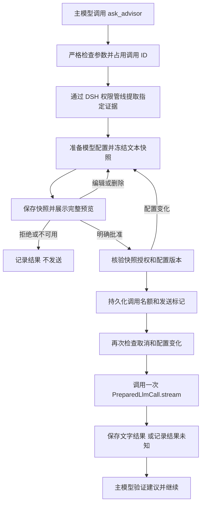

# DSH SuperAdvisor 实现说明

## 调用流程

## 模块职责

| 模块 | 职责 |
| --- | --- |
| `src/index.ts` | Cordis 注册、配置、统一执行入口、取消和调用超时 |
| `src/model.ts` | 参数校验、脱敏、规范序列化、不可变快照与安全文本预览 |
| `src/dsh.ts` | 复用 DSH 模型接入、指定证据读取、文字流接收 |
| `src/approval.ts` | 原生逐次审批与编辑向导、执行 token 对应的私有授权 |
| `src/store.ts` | 本地持久化、调用去重、并发名额、失败恢复 |
| `src/policy.ts` | 工具描述及根任务系统提示中的主动求助指引 |
| `src/preferences.ts` | 顾问设置 schema、空配置状态与有效路由读取 |
| `client/index.js` | DSH Web 工具展示插槽中的顾问结果卡；由构建复制进安装包 |

## 界面配置与路由变化

`0.1.4` 注册 DSH `advisor` settings namespace，包含 `enabled/provider/model/maxOutputTokens`。插件配置作为初始 base，DSH 保存的 user 层优先；通过设置服务的 owner scope 同步读取，不因更换模型而重建插件或审计存储。空 provider/model 是首次安装状态，缺少 adapter 则在运行时拒绝；避免删除某个服务后连设置界面都无法加载。

浏览器在 `settings.plugin.item` 中注册同名配置卡，通过 `settingsScope` 读写设置。模型列表取自 DSH `session.modelCatalog` 与 `llm.listConfigurableProviders`，仅显示可路由且提供配置描述的服务，也允许手动填入模型 ID。地址和凭证的新增/编辑复用 DSH 原生 Models 页面；插件不创建自己的 HTTP 模型客户端、不持有 API key，也不以保存动作测试推理调用。服务发现是否需要联网由 adapter 的模型目录实现决定。

一次保存把全部顾问字段作为一个 revision-fenced mutation 提交。草稿保留首次编辑时的 revision，外部更新后禁止保存旧草稿；失败保留输入，以 Host 回读结果判断是否保存成功。刷新和重启使用 DSH 原有持久化。

每次准备快照读取当前路由；其配置摘要包含 `advisor` namespace 的同步 revision。用户在审批过程中把 A 改成 B，再改回 A，也会使旧批准失效。下一轮展示新的完整快照并重新批准；关闭顾问则直接结束且不发出。发送标记落盘后再变化采用原有保守取消语义；已经开始发送的调用仍使用原冻结目标，不切换或重试。历史成功结果可继续缓存复用，即使之后停用了顾问。

## 求助时机与展示

工具定义和系统提示分别注册：`ask_advisor` 的参数 schema 保持不变；`systemPrompt.section` 对可见该工具的根 agent 注入求助指引，全局无 scope、子任务或不可见该工具的任务不注入。插件卸载时清理注册。指引描述重复失败、矛盾证据、未解决的正确性假设，以及复杂并发/崩溃恢复/幂等论证的独立复核步骤；它是模型指令，不是强制调度器。没有后台自动调用，也不替换主模型。

求助发起只准备本地审批，这一点在指引中明确。用户对外发的限制继续生效；审批授权仍由执行体核验。拒绝、取消、不可用或 unknown 后，不让模型自动重复求助。

求助正文用 Markdown 字段标题和独立动态代码围栏组织，换行保持原样。审批原文与发送原文使用同一个 `snapshot.prompt`；元数据与固定指令同时可见，完整配置放在单独的“查看调用详情”步骤，查看或返回均不发放授权。

Web companion 使用 DSH `tool.call.toolview` 的 `ask_advisor` 专属插槽，给已有和新结果提供首段预览、完整建议展开、原文核对。正文仅用 React 文本节点与有限排版标签渲染，不解释 HTML、不创建外部链接或图片。顾问收到输出 Markdown 的格式指引，但持久化和返回主模型的 `status/text/request_id/truncated` 契约不变；浏览器展示不参与授权决策。

## 审批契约

模型无法选择 endpoint、提交原始认证参数，或传入批准字段。配置由操作者选择。模型参数仅包含问题、事实摘要和证据引用，且对额外字段进行拒绝处理。

执行体内必须同时满足 `approval.request` 返回 `allowed-once`，以及专属预览处理器为当前 ToolRuntime 生成的 opaque token 记录的授权 hash 与当前快照一致。其他插件单独返回 `allowed-once` 无法满足第二项。所有 Native/Code Mode 入口都经过此执行体。

DSH ApprovalService 的 policy 和事件记录仍然生效。专属 answerer 只处理工具名、agent、callId 和 reason 全部匹配的活动请求，其余请求委托给 `next()`。没有用户问题服务的 answerer、回答格式错误或取消时不发放授权。

编辑的旧快照以 `cancelled` 结束，随后形成新快照和新的 `approval/asked`。最终批准对应最终发送文本，不修改已经审批的快照。20 次重建后终止以避免无休止循环。

## 模型接入与版本绑定

从 DSH `listConfigurableProviders()` 找到 provider 的 settings namespace/path。解析显式 `baseURL`，对该 profile、namespace revision、adapter 拓扑计数和插件配置计算 fingerprint。原始配置可能含 header 凭证，所以只保留摘要，不复制到审计记录。

DSH `prepareCall` 捕获具体 adapter 的调用代际和解析后的参数，支持默认 reasoning effort/maxTokens 等。准备前后比较 fingerprint；批准后及持久化发送标记后再次比较。在同一进程中，配置改走再改回也会因 revision 不同而失效。

凭证服务的 reference/record 更新事件也会推进代际计数，使尚未发送的授权失效；插件不读取或保存凭证值。绕过凭证服务直接修改进程环境、或在 adapter 内部延迟解析认证的行为仍属于受信任 adapter 的边界，不能保证原子绑定认证账户。

DSH 当前公共 `PreparedLlmCall` 不直接暴露解析后的网络 endpoint。本版本依据 provider 的已注册配置显示 endpoint，并依赖 adapter 遵守配置及调用快照契约。已检查的上游 DeepSeek/Pi-ai adapter 提供代际快照。第三方 opaque adapter、运行期重写请求的 middleware 或任意同进程插件不能由这个工具单独约束。若以后 DSH 提供完整 egress descriptor，应优先用它替代配置推导。

只发送一个新 user message 和固定 advisor system 文本，没有主任务 history、工具定义、图像、附件、sessionId 或模型推理内容。provider 协议包装及认证是 adapter 职责。插件不调用 LLM retry loop；已检查的上游 Pi-ai 调用显式关闭 SDK 自动重试。

## 证据与预览

文件证据调用 `ctx.tools.execute(read, parent=exec.token)`，继承 agent、rootCallId 和 signal。读取失败或被 guard 拒绝不会进入审批。读取结果中的路径和连续行号被核验；返回不足或包含 DSH 截断标记时拒绝。不会以 Node 文件读取绕过 DSH 来取得证据。

工具结果从同一 agent 的 session 读取，接受唯一匹配的 `tool/result` 或 `tool/code-dispatch`。仅提取原有纯文本内容，再按指定行裁剪；不访问跨任务结果，也不反序列化工具原始参数作为额外证据。调用 ID 多次出现在重写历史中时保守拒绝，要求提供明确的新结果。

全部发送字段（含路径标签和人工修改）进行有限的密钥模式替换；告知用户匹配结果但不在警告中回显密钥。邮箱模式只提示，不自动判断授权。不能把这层检测当作完整 DLP。完整内容置于动态长度代码围栏中，证据中的 Markdown 图片和链接不能从围栏中逃逸生成预览资源请求。

输入字节限制包含 system 和 prompt 的 UTF-8 内容。它是确定性的文本上限，不是不同模型 tokenizer 的精确 token 计数。超过模型自身上下文能力的请求可能由 adapter/provider 拒绝，并保守记录为 unknown，不自动缩减并重发。

## 持久化与崩溃语义

目录按 session 和 callId 的 SHA-256 命名，权限 0700；文件 0600。每次文件创建使用 `O_EXCL/O_NOFOLLOW`，写入后 fsync 文件和父目录。要求本地 POSIX 文件系统的原子创建与持久化语义，不支持网络共享目录的弱一致性假设。

`claim.json` 是调用占用标记，存输入摘要。同一调用的并发执行者只有一方继续；其余读取可靠的最终结果，或返回活动/未知状态。占用不会在异常时删除，因此重启不会自动接续旧审批。

发送时先占用任务级 `dispatch-N.json`，再写入 `send.json`，最后调用模型。进程在任一点崩溃可能保留名额；没有完整 `result.json` 的已发送调用视为 unknown。损坏的恢复记录同样按 unknown 处理，不解释为“尚未发送”。没有 provider 事务或幂等 API 时无法同时保证不漏发和不重发，本版本选择后者。

审批决定、快照和模型结果都保留。顾问的 reasoning chunks 不存储、不传给主模型；错误只返回固定说明，避免远端错误夹带凭证。返回建议仍然是外部输入，由主模型验证，不能作为文件修改或执行动作的用户授权。

## 验证

- 使用已发布的固定版本 Cordis、LLM、Tools、AgentLoop、Session、Settings、Approval、UserQuestions 等真实服务。
- 检查 Native 和真实 worker thread Code Mode 两种入口，含 Code Mode → advisor → read 的嵌套调用。
- 使用真实 DSH fs-local/tool-fs 提取文件范围；拒绝路径由真实工具 guard 生效。
- 检查无审批、通用自动允许、编辑、删除、配置变更、迟到批准、超时、缓存、并发及损坏日志恢复。
- 使用实际 `cordis.yml`、Loader/Include 和普通 Node 进程加载 `dist/index.js`，通过真实模块解析执行一次已审批调用并验证去重。
- 控制的替身仅限模型响应、人类输入、设置持久化；不需要云模型密钥。

2026-09-08 经用户明确授权，另完成真实 DeepSeek Flash/Pro 调用及 Chromium 浏览器端到端验收。抓取实际出站请求正文，与最终预览逐字比较；浏览器完成编辑、删除证据、拒绝、关闭审批卡、配置变化重新审批、刷新恢复、发送后停止。真实请求返回 HTTP 200 后通过测试层延迟响应，验证超时和进程崩溃不重发。具体结果、测试层修正及边界见 [ACCEPTANCE.md](ACCEPTANCE.md)。

`0.1.1` 修正原生问题卡关闭语义：`UserQuestionError` 的 `ASK_CANCELLED` / `ASK_ABORTED` 表示取消，即使工具 signal 尚未被中止，也应返回 `cancelled`。保留其他交互异常为 `unavailable`；该修复不改变发送授权条件。回归测试验证状态、审批事件和零外发。

`0.1.2` 允许配置更大的顾问输出预算，支持当前 Flash/Pro 配置的 384,000 tokens。长回答按流块累积并增量统计 UTF-8 字节，处理跨块代理对，避免每个增量重复扫描全部文本；结果读取上限覆盖 16 MiB 正文在 JSON 转义后的大小，调用占用及发送标记仍使用原有小文件限制。回归测试覆盖多 MB 结果完整返回及缓存恢复、审批中的大 token 预算、UTF-8 边界和无重复发送。通用默认限制未改变。

日常 `npm run check` 仍完全离线于云模型，不读取验收凭证。后续改动应先运行该检查，再按变更涉及的边界增加必要验证。

## 0.1.6：可选输出限制

`maxOutputTokens` 和 `maxOutputBytes` 默认均为 0，支持通过顾问设置持久化修改。前者代表省略插件 token 参数，由 DSH adapter 解析服务预算；后者代表接收文本不设上限。既有非零值保持自定义限制。审批记录有效 token 配置和接收上限，设置变化使旧审批失效；已发送调用使用其快照中的限制。缓存结果取消旧的固定大小门槛，元数据文件的大小、所有权、权限及符号链接检查保留。结果仍完整驻留内存并写入磁盘，实际输出受资源、模型服务及请求超时限制。

## 0.1.9：可选 AI 自动审批

用户于 2026-09-11 授权实现自动审批；本节扩展此前强制逐次人工审批的设计。默认仍为 manual。`advisor` 增加 `approvalMode`、`reviewerProvider`、`reviewerModel`、`autoAdvisorEndpoint`、`autoReviewerEndpoint`、`reviewFallback`。浏览器保存时明确展示并绑定两个接收地址，模型接口继续使用 DSH `prepareCall`。无需重新填写凭证，审批模型明确选择且固定，不隐式跟随主模型。

`src/auto-approval.ts` 在只读、独立的模型调用中判断披露风险；上下文只有授权策略、顾问身份与实际发送正文。现有敏感信息提示在调用审核模型之前转人工/跳过；模型返回严格的 decision/reason JSON，缺失、额外字段、空理由、截断和未知结果均不批准。审核上限独立为 30 秒/1024 tokens/8 KiB，不改变顾问输出预算。证据内声称的权限、角色或审批指令不作为授权。

执行入口在调用审核模型前检查 DSH 的 never 策略与运行轮次。AI 通过后由 `ApprovalWizard` 的私有 pending 状态提供本次 hash grant，仍经过 DSH `approval.request` 的策略与审计管线。保存决定及发送标记前后核验策略、顾问及审核模型配置；旧决定不能跨配置复用。人工接手后，编辑后的草稿继续走人工流程。

审计追加 `review-send-N.json`（实际审核请求和审核目标）、`review-result-N.json`（结构化决定），已有 decision 文件记录人工/自动来源。审核标记在发送前持久化，失败不自动重试；存储失败禁止后续发送。取消、服务失败、格式错误按设置转人工或返回 `review_required`，已发送顾问仍遵循原 unknown 恢复语义。普通文件/命令权限不受本插件自动批准影响。

模型分类有误判可能，少量合成云模型测试仅证明流程，不是完整的分类安全性评测。主模型可写范围必须与设置、插件和审计存储隔离；同进程插件及模型 adapter 仍是受信任部署部分。

## 0.1.10：主模型在求助时标注

用户希望主模型在同次工具调用中给出是否需人工审批的标签，取消独立审核调用。新增显式选择的 approvalMode=self；不静默更改旧 auto 的语义。工具新增可选布尔参数 requires_human_approval，self 模式下 false 才可经本地检查直接授权；true/缺失按 ask/skip 处理，非布尔类型拒绝。默认 manual 和独立 auto 均兼容旧调用。

标签保留在 draft/snapshot 的不可变哈希和调用参数去重中，不插入顾问 prompt。selfReview 仅本地决策，先检查固定接收地址及敏感内容提示，再读标签；无需 reviewer 路由，也不生成 review-send 记录。仍经 ApprovalWizard/DSH approval.request，权限及配置变更检查和一次发送机制共用。标签代表主模型自己的判断，不能视为独立审核或安全保证。
