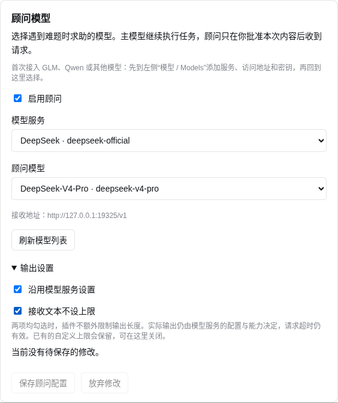

# DSH SuperAdvisor

[English](README.md) | 简体中文

独立的、按需调用的 DeepSeek Harness 顾问工具。主模型调用 `ask_advisor`，按已保存的审批方式处理本次请求，顾问返回文字建议，主模型继续执行。

源码仓库：[kvmem/dsh-super-advisor](https://github.com/kvmem/dsh-super-advisor)。这是 DeepSeek Harness 插件，复用 DSH 的模型、权限和审批服务。

非官方项目，由社区成员独立开发和维护。

`0.1.8` 新增五个 DSH 版本与 Node 22.19+ 的兼容验证，并修复 DSH 0.1.5 下引用 Code Mode 子工具结果作为证据的问题。详见[兼容性矩阵](docs/COMPATIBILITY.md)。这些变更需要安装 0.1.8 包，已安装的 0.1.7 不会自动改变。

`0.1.7` 将项目从 **DSH Advisor** 更名为 **DSH SuperAdvisor**，包名改为 `dsh-super-advisor`。已有用户请按下方升级步骤切换；`ask_advisor` 工具、已保存的模型设置和审计记录保持兼容。

`0.1.6` 支持关闭插件的输出限制。新安装默认沿用所选 DSH 模型服务的 token 预算，接收文本不设大小上限。已有的自定义限制会保留，可以在“输出设置”中关闭。模型与服务限制、可用资源及请求超时仍有效。

`0.1.5` 修复顾问配置保存被静默拦截的问题。无效输入会显示具体原因，点击保存会聚焦该提示，不会写入配置；不可操作的按钮有明确的禁用外观，没有改动时也会提示无需保存。

**2026-09-08：已完成真实 DeepSeek Flash 主模型 → Pro 顾问调用，以及 Chromium 中的审批、编辑、拒绝、取消、超时和重启验收。** `0.1.1` 修复关闭审批卡被记为 `unavailable` 的问题，现在正确返回 `cancelled`。完整结果和实测边界见 [验收记录](ACCEPTANCE.md)。

`0.1.2` 扩展长回答支持，允许设置较大的输出限制。`0.1.6` 将默认行为改为沿用模型服务设置、接收文本不设上限。

`0.1.3` 改善审批与顾问结果展示：审批按问题、目标、约束、尝试、证据分段；调用配置可另行查看。Web 中顾问结果先显示简短预览，支持展开完整建议及核对原文。新增随插件加载的系统提示，说明何时主动求助，以及发起本地审批与实际云端发送的区别。

`0.1.4` 支持直接在 **设置 → 插件 → DSH SuperAdvisor** 中配置。首次安装可以不提供 provider/model；选择 DSH 已接入的服务和模型后保存即可使用，也支持手动填写未列出的模型 ID。保存、刷新和切换不会自动发起推理请求。模型接入范围跟随 DSH adapter，不限于 DeepSeek 或 OpenAI-compatible。

## 全部自动批准（0.1.11）

在 **设置 → 插件 → DSH SuperAdvisor → 审批方式** 选择 **全部自动批准（无额外调用）** 并保存。所有有效求助直接发送给当前显示的顾问地址，包括主模型标注 `requires_human_approval: true`、没有标签或出现本地敏感内容提示的情况。无需独立审批模型，也不逐次弹窗；结果卡和审计记录标明 `always`（全部自动批准）。

保留已有脱敏、DSH 文件/命令权限、宿主 `approval: never`、取消、配置校验、调用次数限制和防重复发送机制。顾问地址变化时返回 `review_required` 并跳过本次求助，需在设置中重新保存新地址，不自动弹窗或重试。此设置只批准发送选中文字，不授权执行建议中的操作。

新安装仍默认每次询问，升级不替换已保存模式。切回其他审批方式并保存即可关闭全部自动批准；保存本身不调用模型。需要使用 **0.1.11** 源码构建或对应安装包。

## 主模型标注审批（0.1.10）

开发版 **0.1.10** 新增 **设置 → 插件 → DSH SuperAdvisor → 审批方式 → 主模型标注（无额外调用）**。选择并保存后，授权把符合条件的请求发给页面展示的顾问地址；无需配置审批模型。升级保留原有模式，新安装仍默认为每次询问。

主模型在**同一次 `ask_advisor` 工具调用**中，随问题和证据一起填写 `requires_human_approval`：

- `false`：普通的已授权文字咨询，本地检查通过后直接发给顾问。
- `true`：按已保存设置等待人工确认，或跳过本次求助。
- 缺少标签：也转人工或跳过；类型错误直接拒绝，不把字符串或数字当成 false。

此模式**没有单独的审批模型推理请求**。标签是主模型自身的判断，不是独立安全复核。本地敏感信息提示、接收地址确认、DSH 权限、取消和防重复发送继续生效；每次询问模式不会被 false 标签绕过。标签纳入不可变审计快照，但不追加到发给顾问的问题里。讨论某项文件或命令操作，仅是文字咨询，后续实际执行仍按原工具权限处理。

每次询问和独立模型审核两种模式仍可选择；后者才会增加一次审核调用。

## AI 自动审批（0.1.9）

**0.1.9** 新增可选独立模型审核，尚未发布 GitHub Release。旧安装与新配置仍默认为每次询问；开启并保存后普通求助自动发送。

操作：**设置 → 插件 → DSH SuperAdvisor → 审批方式 → 独立模型审核（额外调用）**，选择审批模型服务和模型，然后保存。模型复用 DSH Models 中的接入信息，无需再次填写密钥和地址。审批模型需明确选择，保存后固定，不随主模型切换。

保存即授权页面展示的审批模型和顾问接收当前任务所选的问题、代码和诊断证据。云端审批模型会先收到待审核内容；选择本地审批模型可在本机审核。接收地址变化后需重新确认并保存。审核不附加完整历史或隐藏推理，审批模型没有工具。

普通请求通过审核后不再弹窗。风险请求或无效审核结果按“需要人工时”设置**等待确认**，或**跳过本次求助，继续任务**。跳过返回 `review_required`，主模型继续可完成的部分，不代表已获批准或一定能够完成任务。触发凭证/个人信息提示的正文直接进入该分支，不先发给审批模型；人工编辑后仍需人工检查新预览。

结果卡展示人工/AI 审批来源、审批模型和原因。审核会增加一次调用的费用与延迟；审批调用单独设置 30 秒超时、1,024 tokens 和 8 KiB 接收上限，建议选择能稳定返回简短 JSON 的快速模型。格式错误、不完整、超时或不可用都不会批准。这些限制不改变顾问输出沿用模型服务的设置。

自动批准仍经 DSH 审批服务，绑定实际正文、当前配置和一次发送。DSH `approval: never`、取消和已有文件/工具权限继续生效；模型不能扩展授权。策略和配置变化使旧批准失效，包括 A→B→A。审批模型发送/判断与顾问发送都有审计，不自动重试或切换模型。敏感信息规则和 AI 都可能误判，不能保证识别所有私人内容。

## 已实现

- 主模型明确提交问题、目标、约束、已尝试动作及结果，以及最多 8 项证据。
- 文件证据走已有 DSH `read` 工具的权限与执行管线；工具结果只能引用当前任务中已完成的调用。
- 按指定行范围提取纯文本，不自动附带整段会话、系统历史、图片或隐藏推理。
- 原生用户问题卡展示接收地址、provider/model、输出上限，以及实际发送的全部系统指令和求助文本。
- 可替换问题、目标、约束、尝试记录或单项证据内容，也可删除证据；修改后重新生成预览，再单独批准。
- 每次批准绑定不可变快照；可选 AI 审核同样绑定快照；伪造 `approved` 参数和其他通用自动允许不能授权发送。
- 只调用一次 DSH `PreparedLlmCall.stream`，不自动重试或切换 provider。超时/中断后返回明确状态。
- 审计先持久化发送标记，再开始调用；同一任务、同一调用重入时复用已保存结果，或拒绝重复发送。

## 典型使用场景

- **本地主模型 + 云端大模型顾问。** 使用已接入 DSH、具备工具调用能力的本地模型处理日常分析和执行。遇到难题时，用户先审阅并批准一份聚焦的求助请求，再交给更强的云端模型。云端顾问接收获批的问题和选定证据，返回建议后，由本地模型继续验证和执行。
- **Flash 主模型 + Pro 顾问。** 使用 `deepseek-v4-flash` 执行主要任务，遇到难题或需要重点复核时，逐次批准向 `deepseek-v4-pro` 求助。Flash 收到建议后继续完成工作；模型接入复用 DSH Models 中的配置。

这两种搭配的目标是：让日常执行由本地或轻量模型承担，仅在需要时调用更强模型，争取在接近全程使用大模型效果的同时降低成本。实际效果与节省幅度取决于任务、模型、上下文长度和求助频率；目前尚未进行质量与费用的对照评测。

## 兼容范围

已在 **Linux、本地 POSIX 文件系统**上验证 **Node 22.19.0、22.23.2、24.2.0、24.19.0** 与 DSH **`0.1.2-alpha.4`、`0.1.2-alpha.5`、`0.1.2-rc.1`、`0.1.3-alpha.2`、`0.1.5-alpha.1`**。运行时 peer dependencies 明确接受这五个版本；开发依赖继续固定，便于复现构建。更早版本存在已确认的接口不兼容或依赖解析失败，详见[矩阵、限制与复测方法](docs/COMPATIBILITY.md)。

模型接入使用 DSH 的 `provider + model` 和 `ctx.llm.prepareCall`。插件没有自己的 HTTP 客户端，不管理模型部署，也不要求 OpenAI-compatible。DSH adapter 可使用自身支持的协议。

所选 provider 须在 `listConfigurableProviders()` 中登记，并且对应的 **DSH provider 配置须显式设置 `baseURL`**。地址不能含 URL 用户名、密码、查询参数或 fragment。凭证继续由 DSH 的 adapter/credentials 管理，不配置在本插件中。

例如，`llm-deepseek` 的配置根对象使用 `baseURL`；`llm-pi-ai` 的配置在 `providers.<你的 provider>.baseURL`。第三方 adapter 须遵守 DSH 的调用快照契约，且预处理不上传任务数据、单次 stream 不在内部自动重试。

## 构建与安装

安装 GitHub 最新发布版本无需填写版本号（推荐 Node 24；插件 0.1.8 也支持 Node 22.19+ 的 22.x 分支，另需 pnpm 和上文已验证的 DSH 版本）：

```sh
curl -fL https://github.com/kvmem/dsh-super-advisor/releases/latest/download/dsh-super-advisor.tgz -o dsh-super-advisor.tgz
dsh plugin --profile web add ./dsh-super-advisor.tgz
dsh web
```

固定下载地址指向最新 Release，不代表已安装的插件会自动更新。每个 Release 也提供带版本号的 `.tgz`，便于固定版本安装。

### 从 DSH Advisor 0.1.6 及更早版本升级

先完成或停止正在运行的任务并退出 DSH。下载新包后，在同一 profile 中移除旧包注册，再安装新包：

```sh
curl -fL https://github.com/kvmem/dsh-super-advisor/releases/latest/download/dsh-super-advisor.tgz -o dsh-super-advisor.tgz
dsh plugin --profile web remove dsh-tool-advisor
dsh plugin --profile web add ./dsh-super-advisor.tgz
dsh web
```

继续使用原来的 `DSH_HOME` 和已有的 `storageDir` 覆盖配置。设置命名空间 `advisor`、patch 行 ID `advisor`、可选初始环境变量 `DSH_ADVISOR_*` 及 `advisor-audit` 目录保持不变。移除旧包时保留这些数据，以沿用模型选择、输出偏好和防重复发送记录。同一 profile 只安装一个版本。直接通过文件 overlay 加载的开发环境，重新构建源码并保留原 overlay 与审计路径即可。

已有源码目录可运行 `git remote set-url origin https://github.com/kvmem/dsh-super-advisor.git` 更新远端地址，本地目录无需改名。历史 `dsh-tool-advisor-0.1.6.tgz` 附件保留；旧的 latest 文件名 `dsh-tool-advisor.tgz` 继续提供原版 0.1.6。安装 SuperAdvisor 请使用新的文件名。

### 从源码构建

需要从源码构建时：

```sh
git clone https://github.com/kvmem/dsh-super-advisor.git
cd dsh-super-advisor
npm ci
npm run check
npm pack
```

`check` 包含源码和测试的类型检查、集成测试，以及使用真实 Loader/Include 从 `cordis.yml` 加载构建产物的独立 Node 验证。测试通过受控 adapter 回答，不调用任何真实付费模型。

推荐使用 Node 24.2+；也支持 Node 22.19+ 的 22.x 分支，并需准备受支持的 DSH 版本和其插件安装所需的 pnpm。仓库包含 `.nvmrc`，已安装 nvm 时可运行 `nvm install` 和 `nvm use`。较早的 Node 22 版本缺少 DSH 的 Code Mode worker 或会话持久化所需的 API。请检查实际启动 DSH 的 Node 路径；终端切换版本不会改变已运行的服务。在项目目录构建后安装并启动 Web 界面：

```sh
dsh plugin --profile web add "$PWD/dsh-super-advisor-0.1.10.tgz"
dsh web
```

首次使用全部可以在界面完成：

1. 在 **设置 → 模型（Models）** 中添加或编辑模型服务，填写实际服务地址、API key 和模型信息。接入自定义 GLM、Qwen 或其他服务时，选择该服务支持且 DSH adapter 提供的协议；密钥由 DSH credentials 管理。
2. 在 **设置 → 插件（Plugins）→ 顾问模型** 选择模型服务、顾问模型并保存。也可手动填写模型 ID，但是否能直接使用由 adapter 决定；例如当前 Pi-ai adapter 要求先在 Models 中登记该模型。
3. 展开“输出设置”，勾选 **“沿用模型服务设置”** 和 **“接收文本不设上限”**，保存后即可去掉插件的两项输出限制。新安装默认勾选；取消任一勾选可设置相应的自定义上限。“启用顾问”控制是否允许发起新的求助。

顾问直接读取 Models 中已经保存的地址，无需重复配置。如果已选好服务和模型仍无法保存，请按卡片提示排查；只有提示缺少地址时，才检查服务是否明确保存了地址：进入 **设置 → 模型 / Models → 编辑 / Edit → 自定义设置 / Customized settings**，填写 **API 地址 / Base URL**，点击 **应用 / Apply**，再返回顾问卡片保存。输入框里的灰色提示（例如 `https://api.deepseek.com`）不是已保存的值。部分 DSH adapter 可使用默认地址或环境变量，但本插件需要明确的 `baseURL` 来展示并绑定审批目标。同时检查输出预算，以及卡片上的冲突或只读提示。

配置由 DSH 持久化，刷新页面、重启服务后仍保留。它不修改主任务选择的模型。默认逐次人工审批，也可明确开启 AI 自动审批；待审批期间修改顾问配置会使旧快照失效，已发出的请求继续使用原快照。两个页面同时编辑时，过期草稿不能覆盖新配置，需要先重新载入。

随包的 `cordis.patch.yml` 插入 `advisor` 配置项。高级部署仍可用启动环境变量 `DSH_ADVISOR_PROVIDER` / `DSH_ADVISOR_MODEL` 设置初始值，或在 profile 的 patch 中提供：

```yaml
- id: advisor
  config:
    provider: your-existing-provider
    model: your-advisor-model
```

界面保存的 `advisor` 设置覆盖这些初始值。缺少目标时插件正常加载，界面可配置，工具返回 `not_configured` 并且不发送。模型服务不可用或没有显式 `baseURL` 时，同样不发送。

本地开发可直接加载构建文件：

```sh
dsh --profile web --patch "$PWD/examples/local.cordis.patch.yml"
```

以上命令从源码仓库根目录运行；DSH 将示例中的 `../dist/index.js` 按 patch 文件位置解析，避免配置依赖特定机器上的目录。Flash 主模型、Pro 顾问的完整开发配置另见 [DeepSeek 示例](examples/deepseek-flash-pro.cordis.patch.yml)，使用模型 ID `deepseek-v4-flash`、`deepseek-v4-pro`。先通过 DSH 配置凭证或向启动进程提供 `DEEPSEEK_API_KEY`，再加载该 overlay；不要把密钥写入 patch：

```sh
dsh --profile web --patch "$PWD/examples/deepseek-flash-pro.cordis.patch.yml" --no-open
```

该 DeepSeek 示例配置了较高的输出预算，实际输出受服务及模型限制。其他服务使用通用配置，并在 Models 页面登记模型。

请选择安装 bundle 或本地 overlay 中的一种，避免注册两个同名工具。Profile 必须已有 `tools`、`llm`、`settings`、`agents`、`approval`、`userQuestions`、`systemPrompt` 服务，以及能呈现完整 `detail` 的交互界面。文件证据另需现有的 `read` 工具。Web 结果卡通过包内 `./client` 和 DSH 工具展示插槽加载；使用上述安装或本地加载方式均可发现。

仓库保存可重新构建的源码和测试；安装包由 `npm pack` 生成。发布时可将 `.tgz` 作为 GitHub Release 附件，不提交依赖目录或本机构建输出。文件范围和发布步骤见 [发布说明](docs/RELEASING.md)。

## 求助和审批示例

以下顾问设置截图来自真实 DSH 的本地测试配置：



插件向能使用 `ask_advisor` 的根任务注入求助指引：常规工作自行完成；同一障碍两次实质尝试失败、证据与解释矛盾、核心正确性假设未解决时，发起一次聚焦的独立复核。对并发、崩溃恢复、重试和幂等相互影响的复杂正确性论证，要求先形成候选结论及反例，再在最终定论前求助。该规则由模型理解并执行，不是程序计数器或自动切换器，不能保证每次必然调用；明确的用户限制仍优先。替换整个系统提示的自定义 persona 也可能覆盖这些指引。

主模型可以调用：

```json
{
  "question": "这个空输入错误最可能发生在哪里？请给出验证方法。",
  "goal": "修复解析器的空输入处理",
  "constraints": "保留现有公开接口",
  "attempts": "已运行测试；普通输入通过，空输入失败。",
  "evidence": [
    { "kind": "file", "source": "src/parser.ts", "start_line": 30, "end_line": 55 },
    { "kind": "tool_result", "source": "prior-test-call-id", "start_line": 1, "end_line": 8 }
  ]
}
```

文件路径按 DSH 当前任务目录解释。`tool_result.source` 是当前任务中已经完成的工具调用 ID，Code Mode 的子调用 ID 也可引用。工具结果只在拼接后的文本中按 1 起始行号选择。不存在的行、二进制内容、混合媒体和被文件读取工具截断的片段会被拒绝；没有需要补充的证据时传 `[]`。

用户先看到按字段分段的完整预览，再选择“批准并发送”“编辑内容”“删除证据”“拒绝”或“查看调用详情”。调用详情展示完整配置和请求编号，返回审批后仍须单独批准；查看详情不发送。编辑使用原生问题卡的字段选择和全文替换，并非独立网页编辑器。只有选择“批准并发送”并提交才授权发送；关闭界面、无回答、通用批准或旧回答都不算此次批准。

发送后顾问只有文字上下文，无文件、网络浏览或执行工具。工具返回 `status/text/request_id/truncated`，主模型负责验证建议；`truncated: true` 表示顾问达到输出 token 上限。

Web 结果卡默认显示顾问正文首段的简短预览（并非另一次模型摘要）。展开后按标题、列表、强调和代码显示建议；“原文与核对信息”保留未经展示转换的完整正文及请求编号。未支持的 Markdown 以文本呈现，HTML、链接和图片不触发外部资源加载。模型接收的结构化结果、持久化记录及原有会话不因此改写。

| 状态 | 含义 |
| --- | --- |
| `ok` | 文字建议已保存，可以继续执行 |
| `denied` / `cancelled` | 未取得有效授权，或在发送前取消 |
| `unavailable` | 缺少交互服务、准备/存储不可用，或旧调用在发送前中断 |
| `not_configured` / `disabled` | 尚未从界面配置顾问目标，或顾问已停用；未发送 |
| `model_unavailable` | Adapter 尚未接入所选模型；先从 Models 界面添加，再选择；未发送 |
| `unknown` | 可能已发送，但没有可靠的完成记录；不会自动重发 |
| `conflict` | 同一调用 ID 被用于不同参数 |
| `budget_exhausted` | 本任务已耗尽可用的发送名额 |
| `evidence_*` / `context_too_large` / `invalid_*` / `endpoint_required` | 证据、参数或接入配置需要修正，尚未发送 |
| `error` | 顾问完成但没有文字建议 |

拒绝后不自动再次求助。`unknown` 需要由人决定是否发起新调用；旧授权不允许重试。取消无法撤回已经到达远端的文本。

## 配置和审计

| 配置 | 默认值 | 用途 |
| --- | --- | --- |
| `provider`、`model` | 空，等待界面配置 | 使用已有 DSH 模型路由；旧 patch / 环境变量可提供初始值 |
| `enabled` | true | 界面中的“启用顾问”，保存在 DSH 的 `advisor` 设置中 |
| `storageDir` | `$DSH_HOME/advisor-audit`，未设置 DSH_HOME 时为 `~/.dsh/advisor-audit` | 本地审计与恢复记录 |
| `maxInputBytes` | 32768 | 系统指令和完整求助文本合计 UTF-8 字节上限 |
| `maxOutputTokens` | 0 | 0 表示不覆盖 DSH 模型服务的 token 设置；可选自定义上限为 128–1,000,000 tokens |
| `maxOutputBytes` | 0 | 0 表示插件接收文本不设上限；可选自定义上限为 1024–16,777,216 UTF-8 字节 |
| `maxCallsPerTask` | 8 | 持久化发送名额，跨进程共享 |
| `timeoutMs` | 120000 | 批准后模型调用的最长等待时间 |

两项输出设置均持久化在 `advisor` 命名空间，界面保存的值覆盖安装 patch。升级保留已有的显式上限（包括旧 patch 或设置中保存的默认值）；在界面勾选上述两项并保存即可关闭。token 设置为 0 时，插件省略输出预算参数，不会向模型发送 `maxTokens: 0`。审批展示 adapter 解析后的有效预算；若 adapter 未提供数值，则明确显示由模型服务决定，不宣称模型可无限输出。默认 120 秒请求超时仍然有效。

输入超限不静默截断；token 上限和实际计费语义由 provider 实现。审批展示 adapter 解析后的调用配置，不估算费用。一次求助最多允许 20 轮预览重建。

审计目录要求当前用户所有、权限 `0700`，文件 `0600`，拒绝符号链接路径。默认保存经过规则脱敏的请求快照、审批决定、发送标记和最终结果；不会写入原始 provider 配置、认证 headers、API key 环境值、远端错误详情或模型推理流。快照可能仍含用户明确批准的代码和业务信息。

审计记录不自动删除：删除记录会同时删除防重复与任务调用限额的依据。只在相关任务不再恢复、没有运行中请求后，由用户按自己的保留策略处理。主模型的文件/命令工具不得具有修改该审计目录的权限；这属于 DSH 运行环境的隔离配置。

## 具体边界

- 这是按需顾问，未实现后台被动审查、多顾问投票、模型接管任务或顾问自主浏览。
- 仅支持根任务。人工审批需要交互界面；AI 自动审批可无交互运行。DSH `approval: never` 禁止调用审批模型和顾问。
- 审批冻结的是**文本和模型调用配置**，文件在预览后变化也不会偷偷刷新；更新证据需要新请求。
- 密钥检测是启发式规则，不能识别所有私密信息。用户须通过完整预览决定哪些文本可以发送；原始主模型工具参数仍由 DSH 自己记录。
- `baseURL` 表示 adapter 使用的接收基址。代理、DNS、HTTP 重定向和同进程其他插件属于受信任部署边界，不承诺控制最终网络对端。
- 保证的是本地防止重复发起，不是跨 provider 的“恰好一次”处理。宕机可能消耗一个名额而未实际发出；宁可返回未知，也不重发。
- 普通文件权限不能对抗同一 OS 用户运行的任意代码。需要把审计目录隔离在主模型可写范围之外。
- 已完成真实 DSH 服务、Code Mode、文件读取和 Loader 集成测试；另已用真实 Flash/Pro 和 Playwright 操作 Chromium 验收 Standard mode 的完整审批流程。推理开关、其他 adapter、其他浏览器及 Code Mode 的浏览器交互不在本次云端验收范围内，详见 [验收记录](ACCEPTANCE.md)。

实现边界和维护说明见 [DESIGN.md](DESIGN.md)。DSH 接口依据：[模型 adapter](https://github.com/deepseek-ai/deepseek-harness/tree/master/packages/llm/llm)、[审批服务](https://github.com/deepseek-ai/deepseek-harness/tree/master/packages/interaction/user-approval)、[用户问题服务](https://github.com/deepseek-ai/deepseek-harness/tree/master/packages/interaction/user-questions)、[插件打包说明](https://github.com/deepseek-ai/deepseek-harness/blob/master/docs/user/develop/basic/publish.md)。


## 许可证

[MIT](LICENSE)，版权所有 (c) 2026 kvmem。
